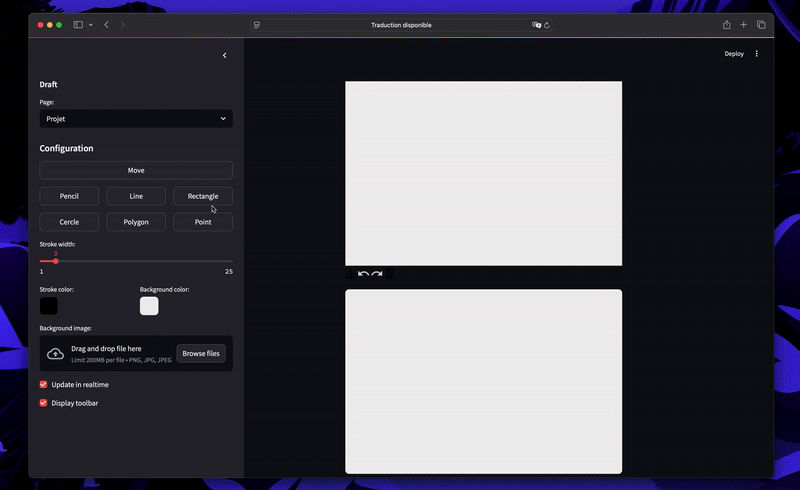

### Mini figma

This Streamlit app is a mini Figma-like tool that lets users draw, annotate, and interact with images using shapes, lines, and colors. It includes a customizable canvas with drawing modes, color pickers, and image upload functionality.

## Technologies Used
- **Python**: Core programming language.
- **Streamlit**: is an open-source Python library that makes it easy to create and share custom web apps for machine learning and data science.

### Preview




### Installation

1. Clone this repository:
   ```bash
   git clone <link>
   cd your-repo
   ```
2. Install dependencies:
   ```bash
   pip install streamlit streamlit_drawable_canvas
   ```
3. Run the application:
   ```bash
   streamlit run app.py  
   ```
